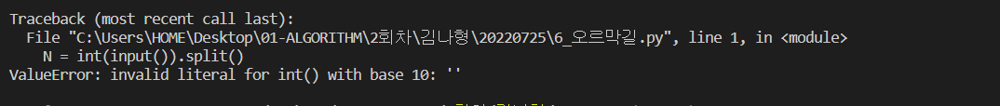
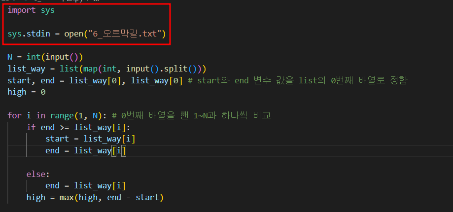
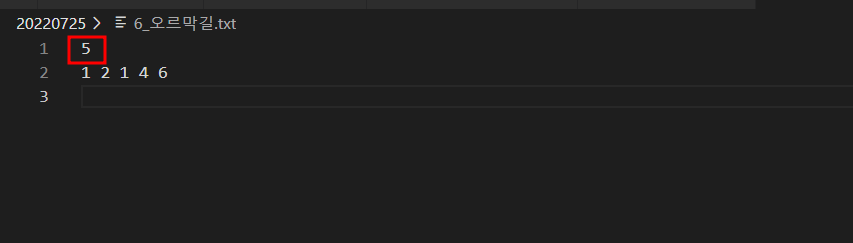

# 파이썬 오류 모음집

> python error book

---

- ValueError: invalid literal for int() with base 10: '

  _input 받아야할 값이 int형으로 불러질 수 없다고 나온 오류_

  

  

  -> input 값이 적혀있는 6_오르막길.txt에 값이 문제가 있는지 확인함.

  

  -> 5 라는 하나의 정수값이 아닌  둘쨋 줄에 있는 1 2 1 4 6 만 입력되어있어 둘쨋 줄에 있는 하나 이상의 값을 불러오면서 생긴 오류로 확인

  -> 첫째 줄에 5를 넣어주며 데이터 수정

---

