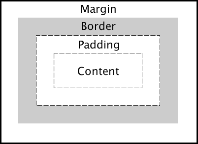
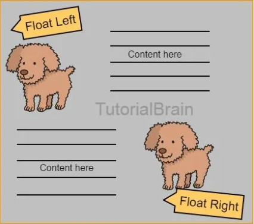

# CSS

> Cascading Style Sheets : 스타일을 지정하기 위한 언어
>
> 우선 순위 tag  <  class  <  id

```css
(선택자: Selector)
h1{
    color: blue; (선언 : Declaration)
    font-size: 15px;
    (속성: Property) (값:Value)
}
```


- 각 쌍은 선택한 요소의 속성, 속성에 부여할 값을 의미
  - 속성 (Property) : _WHAT?_ 스타일 기능 변경

  - 값(Value) : _HOW?_ 스타일 기능 변경

    

#### CSS with 개발자 도구

- styles : 해당 요소에 선언된 모든 CSS

- computed : 해당 요소에 최종 계산된 CSS

  

#### CSS 기초 선택자

- 요소 선택자
  - HTML 태그를 직접 선택

- 클래스(class) 선택자
  - 마침표(.)문자로 시작하며, 해당 클래스가 적용된 항목을 선택

- 아이디(id) 선택자

  - 문자로 시작하며, 해당 아이디가 적용된 항목을 선택

  - 일반적으로 하나의 문서에 1번만 사용

  - 여러 번 사용해도 동작하지만, 단일 id를 사용하는 것을 권장


---


### 📌```CSS 기본 스타일```

#### 크기 단위

- px(픽셀)

  - 모니터 해상도의 한 화소인 '픽셀' 기준
  - 필셀의 크기는 변하지 않기 때문에 고정적인 단위

- %

  - 백분율 단위
  - 가변적인 레이아웃에서 자주 사용

- em

  - (바로 위, 부모 요소에 대한) 상속의 영향을 받음
  - 배수 단위 요소에 지정된 사이즈에 상대적인 사이즈를 가짐

  ___예시___

  ```css
  div {
    font-size: 20px;
    width: 10em; /* 200px */
  }
  ```

- rem

  - 상속의 영향을 받지 않음
  - 최상위 요소(html)의 사이즈를 기준으로 배수 단위를 가짐

  ___예시___

  ```css
  div {
    font-size: 20px;
    width: 10rem; /* 160px */
  }
  ```

  

- VW

  - vw단위는 웹 브라우저의 가로폭 (너비)를 기준으로 결정되는 크기
  
  __예시__
  
  브라우저의 너비가 1280
  
  ```css
  .vw{
      font-size: 10vw; /*12.8px*/
  }
  ```


- Vh

  웹 브라우저의 세로폭(높이)를 기준으로 결정되는 크기

  ___예시___

  브라우저의 높이 600

  ```css
  .vh{
      font-size: 10vh;/*6px*/
  }
  ```


- vmin / vmax

  웹 브라우저의 가로폭(너비)와 세로폭(높이) 중 가장 작거나, 가장 큰 값을 기준으로 결정

  ___예시___

  ```css
  .vmin{
      font-size: 10vmin;
  }
  .vmax{
      font-size: 10vmax;
  }
  ```


#### 색상단위

- 색상 키워드

- RGB 색상
  - #’ + 16진수 표기법
    - rgb() 함수형 표기법

- HSL 색상
  - 색상, 채도, 명도

- a는 alpha(투명도)

```css
p { color: black; }
p { color: #000; }
p { color: #000000; }
p { color: rgb(0, 0, 0); }
p { color: hsl(120, 100%, 0); }
p { color: rgba(0, 0, 0, 0.5); }
p { color: hsla(120, 100% 0.5);}

/*모두 블랙*/
```


---


### 📌```CSS 선택자```

- 요소 선택자

- 클래스(class) 선택자
  - 마침표(.)문자로 시작하며, 해당 클래스가 적용된 항목을 선택

- 아이디(id) 선택자

  - 문자로 시작하며, 해당 아이디가 적용된 항목을 선택

  - 일반적으로 하나의 문서에 1번만 사용

  - 여러 번 사용해도 동작하지만, 단일 id를 사용하는 것을 권장

    

#### CSS 적용 우선순위 (cascading order)

1. 중요도 (Importance) : 사용시 주의

   - !important

2.  우선 순위 (Specificity)

   - 인라인 > id > class, 속성, pseudo-class > 요소, pseudo-element

3. CSS 파일 로딩 순서

   

#### CSS 상속

- 상속 되는 것

  ```Text 관련 요소```(font, color, text-align), opacity, visibility 등

- 상속 되지 않는 것

  ```Box model 관련 요소``` (width, height, margin, padding, border, box-sizing, display)

  ```position 관련 요소```(position, top/right/bottom/left, z-index) 등


---


### 📌```CSS Box model```

> 모든 요소는  Box이고 위에서부터 아래로, 왼쪽에서 오른쪽 쌓임.




- 모든 HTML 요소는 box  형태로 되어있음
- 하나의 박스는 네 부분(영역)으로 이루어짐 (상기 이미지 참조)
  - margin : 테두리 바깥의 외부 여백
  - border : 테두리 영역
  - padding : 테두리 안쪽의 내부 여백 (요소에 적용된 배경색, 이미지는 패딩까지 적용)
  - content : 글이나 이미지등 요소의 실제 내용


---


### 📌```CSS Display```

- CSS 원칙 

>  모든 요소는 네모(박스모델)이고, 좌측상단에 배치
>
> display에 따라 크기와 배치가 다름


#### 대표적으로 활용되는 display

-  ```display```: block
  - 줄 바꿈이 일어나는 요소
  - 화면 크기 전체의 가로 폭을 차지한다. 
  - 블록 레벨 요소 안에 인라인 레벨 요소가 들어갈 수 있음.

- ```display```: inline

  - 줄 바꿈이 일어나지 않는 행의 일부 요소

  - content 너비만큼 가로 폭을 차지한다. 

  - width, height, margin-top, margin-bottom을 지정할 수 없다.

  - 상하 여백은 line-height로 지정한다.

    

#### 블록 레벨 요소와 인라인 레벨 요소

- 대표적인 __블록__ 레벨 요소

  ```div``` : 콘텐츠 분할 요소 

  `ul`, ```ol```, ```li``` : 리스트 세트 <ul> + <li> 순서가 없음/ <ol> + <li> 순서가 있음

   `p` : 하나의 문단

   `hr`  : 이야기 장면 전환, 구획 내 주제 변경 등, 문단 레벨 요소에서 주제의 분리

  `form` : 정보를 제출하기 위한 대화형 컨트롤

- 대표적인 인라인 레벨 요소 

  `span` :  문 콘텐츠를 위한 통용 인라인 컨테이너

  `a` :  [`href`](https://developer.mozilla.org/ko/docs/Web/HTML/Element/a#attr-href) 특성을 통해 다른 페이지나 같은 페이지의 어느 위치, 파일, 이메일 주소와 그 외 다른 URL로 연결할 수 있는 하이퍼링크

  `img` : 이미지 삽입 요소

  `input` :  웹 기반 양식에서 사용자의 데이터를 받을 수 있는 대화형 컨트롤

  `label` : 사용자 인터페이스 항목

  `b` : 굵은 글씨 요소

  `em` : 텍스트의 강세

  `i` : 글자를 기울이기만 하는 단순한 시각적 요소 (기술 용어, 외국어 구절, 등장인물의 생각 등을 예시)

  `strong` : 중대하거나 긴급한 콘텐츠를 (보통 브라우저는 굵은 글씨)


### 📌`CSS Position`

> 문서 상에서 요소의 위치를 지정

- static : 모든 태그의 기본 값(기준 위치) 

  - 일반적인 요소의 배치 순서에 따름(좌측 상단)
  - 부모 요소 내에서 배치될 때는 부모 요소의 위치를 기준으로 배치 됨

- 아래는 좌표 프로퍼티(top, bottom, left, right)를 사용하여 이동 가능

  1. relative : 상대 위치

     - 자기 자신의 static 위치를 기준으로 이동  (normal flow 유지)
     - 레이아웃에서 요소가 차지하는 공간은 static일 때와 같음 (normal position 대비 offset)

     

  2. absolute : 절대 위치

     - 요소를 일반적인 문서 흐름에서 제거 후 레이아웃에 공간을 차지하지 않음  (normal flow에서 벗어남)
     - 부모/조상 요소를 기준으로 이동 (없는 경우 브라우저 화면 기준으로 이동)

     

  3. fixed : 고정 위치 

     - 요소를 일반적인 문서 흐름에서 제거 후 레이아웃에 공간을 차지하지 않음 (normal flow에서 벗어남)
     - 부모 요소와 관계없이 viewport를 기준으로 이동 • 스크롤 시에도 항상 같은 곳에 위치함

     

  4. sticky : 스크롤에 따라 static -> fixed로 변경

     - 속성을 적용한 박스는 평소에 문서 안에서 position: static 상태와 같이 일반적인 흐름에 따르지만 

       스크롤 위치가 임계점에 이르면 position: fixed와 같이 박스를 화면에 고정할 수 있는 속성

     

### Float

> 박스를 왼쪽 혹은 오른쪽으로 이동시켜 텍스트를 포함 인라인요소들이 주변을 wrapping 하도록 함
>
> 요소가 Normal flow를 벗어나도록 함





### Flexbox

> 행과 열 형태로 아이템들을 배치하는 1차원 레이아웃 모델


📢 __WHY?__

1. 수직 정렬
2. 아이템의 너비와 높이 혹은 간격을 동일하게 배치


- 축 
  - main axis (메인 축) 
  - cross axis (교차 축)

- 구성 요소

  - Flex Container (부모 요소)

    flexbox 레이아웃을 형성하는 가장 기본적인 모델

    Flex Item들이 놓여있는 영역

    display 속성을 flex 혹은 inline-flex로 지정

    

  - Flex Item (자식 요소)

    컨테이너에 속해 있는 컨텐츠(박스)

​				

### Flex 속성

- 배치 설정 

  - `flex-direction` : Main axis 기준 방향 설정

  - `flex-wrap` : 아이템이 컨테이너를 벗어나는 경우 해당 영역 내에 배치되도록 설정

  - `Flex` 속성 : `flex-direction` & `flex-wrap`

    - `flex-direction` : Main axis의 방향을 설정

    - `flex-wrap` : 요소들이 강제로 한 줄에 배치 되게 할 것인지 여부 설정

      `nowrap` (기본 값) : 한 줄에 배치

      `wrap `: 넘치면 그 다음 줄로 배치

    - `flex-flow`

      flex-direction 과 flex-wrap 의 shorthand

      flex-direction과 flex-wrap에 대한 설정 값을 차례로 작성

      예시) flex-flow: row nowrap;


- 공간 나누기

  - `justify-content` (main axis) : Main axis를 기준으로 공간 배분

    

  

  

  - `align-content` (cross axis) : Cross axis를 기준으로 공간 배분 (아이템이 한 줄로 배치되는 경우 확인할 수 없음)

    

    

  - `Flex `속성 : `justify-content` & `align-content`

    - `flex-start` (기본 값) : 아이템들을 axis 시작점으로
    - `flex-end `: 아이템들을 axis 끝 쪽으로 
    - `center` : 아이템들을 axis 중앙으로 
    - `space-between `: 아이템 사이의 간격을 균일하게 분배
    - `space-around `: 아이템을 둘러싼 영역을 균일하게 분배 (가질 수 있는 영역을 반으로 나눠서 양쪽에) 
    - `space-evenly` : 전체 영역에서 아이템 간 간격을 균일하게 분배

    

- 정렬

  `align-items `(모든 아이템을 cross axis 기준으로) 

  `align-self`(개별 아이템)

  

  - `Flex` 속성 : `align-items` & `align-self`  (Cross axis를 중심으로)

    - `stretch` (기본 값) : 컨테이너를 가득 채움

    - `flex-start` : 위

    - `flex-end `: 아래

    - `center` : 가운데

    - `baseline` : 텍스트 baseline에 기준선을 맞춤
    
      

### 가상 요소(Pseudo-Element)

> 별도의 `class`를 지정하지 않아도 지정한 것 처럼 요소 선택 가능
>
> `가상요소`는, 가상 클래스처럼 `선택자(selector)`에 추가되며 
>
> 존재하지 않는 요소를 존재하는 것처럼 부여하여 문서의 특정 부분이 선택 가능

|      요소      |                             소개                             |
| :------------: | :----------------------------------------------------------: |
|  ::first-line  |            요소의 텍스트에서 첫 줄에 스타일 적용             |
| ::first-letter |              요소의 첫 번째 글자에 스타일 적용               |
|    ::before    |        요소의 콘텐츠 시작 부분에 생성된 콘텐츠를 추가        |
|    ::after     |         요소의 콘텐츠 끝 부분에 생성된 콘텐츠를 추가         |
|  ::selection   | 요소의 텍스트에서 사용자에 의하여 선택(드래그)된 영역의 속성을 변경 |
| ::placeholder  |           Input 필드에 힌트 텍스트에 스타일을 적용           |


### ::before & ::after

- ::before 

  실제 내용 바로 앞에서 생성되는 자식요소

-  ::after

  실제 내용 바로 뒤에서 생성되는 자식요소

🔈 `before`/ `after` 과 함께 쓰이는`content=""`

HTML 문서에 정보로 포함되지 않은 요소를 CSS에 새롭게 생성시켜주는 __가짜__ 속성

|  속성   |                             사용                             |
| :-----: | :----------------------------------------------------------: |
| normal  |                아무것도 표시하지 않는 기본값                 |
| string  |                         문자열 생성                          |
|  image  |   이미지나 비디오를 불러올 수 있음.<br />크기 조절 불가능    |
| counter | 순서를 매길 수 있음.<br />conter-increment, counter-reset 함께 사용 |
|  none   |                    아무것도 표시하지 않음                    |
|  attr   |                   해당 속성의 속성값 표시                    |

[출처]: https://developer.mozilla.org/ko/docs/Web/CSS/Pseudo-elements

🤡 ___Flex Floggy___

- [게임으로 이해하기 start!](https://flexboxfroggy.com/#ko_)

