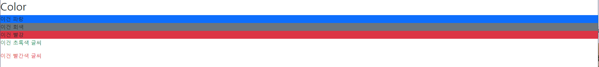

# HTML

### HTML 기초 < _시맨틱태그_ >

> HTML 태그가 특정 목적, 역할 및 의미적 가치(semantic value)를 가지는 것

- 대표적인 시맨틱 태그 목록
  - header : 문서 전체나 섹션의 헤더(머리말 부분) 
  - nav : 내비게이션
  - aside : 사이드에 위치한 공간, 메인 콘텐츠와 관련성이 적은 콘텐츠
  - section : 문서의 일반적인 구분, 컨텐츠의 그룹을 표현
  - article : 문서, 페이지, 사이트 안에서 독립적으로 구분되는 
  - footer : 문서 전체나 섹션의 푸터(마지막 부분)

🤷‍♂️ `시맨틱 태그` 사용 해야 하는 이유

-  의미론적 마크업

  - 개발자 및 사용자 뿐만 아니라 검색엔진 등에 의미 있는 정보의 그룹을 태그로 표현

  - 단순히 구역을 나누는 것 뿐만 아니라 ‘의미’를 가지는 태그들을 활용

  -  코드의 가독성을 높이고 유지보수 용이

  - 검색 엔진 최적화(SEO)

    

---


### HTML 문서 구조화

- `table 태그` 기본 구성

  - thead
    - tr > th (head)
  - tbody
    - tr > td (data)
  - tfoot
    - tr > td (data)
  - caption

  

### form

> `<form>`은 정보(데이터)를 서버에 제출하기 위해 사용하는 태그

- 기본 속성

  - action : form을 처리할 서버의 URL (데이터를 보낼 곳)

  - method : form을 제출할 때 사용할 HTTP 메서드 (GET or POST)

  - enctype : method가 post인 경우 데이터의 유형

    - application/x-www-form-urlencoded : 기본값

    - mulipart/form-data : 파일 전송시 (input type이 file인 경우)

      

### input label

> `<label>`은 폼의 양식에 이름 붙이는 태그

- label을 클릭하면, 연결된 양식에 입력할 수 있도록 하거나, 체크를 하거나, 체크를 해제한다.
- `<input>`에 id 속성을, `<label>`에는 for 속성을 활용하여 상호 연관을 시킨다.


___예시___

```html
<!--<body> 입력 값-->

<label for="inputName">이름 :</label>
<input type="text" id="inputName">
```


___결과___

<!DOCTYPE html>
<html lang="en">
<head>
  <meta charset="UTF-8">
  <meta http-equiv="X-UA-Compatible" content="IE=edge">
  <meta name="viewport" content="width=device-width, initial-scale=1.0">
  <link rel="stylesheet" href="css/_reset.css">
  <link rel="stylesheet" href="css/style.css">
  <title>HPHK APPAREL</title>
</head>
<body>
  <label for="inputName">이름 :</label>
  <input type="text" id="inputName">
</body>
</html>


### input 유형 – 일반

> 일반적으로 입력을 받기 위하여 제공되며 타입별로 HTML기본 검증 혹은 추가 속성을 활용 가능

- text : 일반 텍스트 입력
- password : 입력 시 값이 보이지 않고 문자를 특수기호(*)로 표현
- email : 이메일 형식이 아닌 경우 form 제출 불가
- number : min, max, step 속성을 활용하여 숫자 범위 설정 가능
- file : accept 속성을 활용하여 파일 타입 지정 가능


### input 유형 – 항목 중 선택

> 일반적으로 label 태그와 함께 사용하여 선택 항목을 작성

- 동일 항목에 대하여는 name을 지정하고 선택된 항목에 대한 value를 지정해야 함

  - check box : 다중 선택

  - radio : 단일 선택

___check box 예시___

```
<!--<body> 입력 값-->

<label for="ice">아이스아메리카노</label>
<input type="checkbox" id="ice" value="i/a">
<label for="hot">아메리카노</label>
<input type="checkbox" id="hot" value="h/a">
<label for="latte">라떼</label>
<input type="checkbox" id="latte" value="latter">

```


___결과___

<!DOCTYPE html>
<html lang="en">
<head>
  <meta charset="UTF-8">
  <meta http-equiv="X-UA-Compatible" content="IE=edge">
  <meta name="viewport" content="width=device-width, initial-scale=1.0">
  <link rel="stylesheet" href="css/_reset.css">
  <link rel="stylesheet" href="css/style.css">
  <title>HPHK APPAREL</title>
</head>
<body>
  <div class ="id">
    <label for="ice">아이스아메리카노</label>
    <input type="checkbox" id="ice" value="i/a">
    <label for="hot">아메리카노</label>
    <input type="checkbox" id="hot" value="h/a">
    <label for="latte">라떼</label>
    <input type="checkbox" id="latte" value="latter">
  </div>  
</body>
</html>


---

### Bootstrap

- spacing (Margin and padding)

  ✔`{property}{sides}-{size}`

  

  ​		Where _property_ is one of:

  - `m` - for classes that set margin

  - `p` - for classes that set padding

    

    Where _sides_ is one of:

  - `t`  - `margin-top` or `padding top`

  - `b` - `margin-bottom` or `padding bottom`

  - `s` - `margin-left` or `padding-left` in LTR / `margin-right` or `padding-right` in RTL

  - `e` - (end)  `margin-right` or `padding-right` in LTR /  `margin-left` or `padding-left` in  RTL

  - `x` - both `*-left` and `*-ringt`

  - `y` - both `*-top` and `*-bottom`

    

    Where _size_ is one of:

    | size | rem      | px   |
    | ---- | -------- | ---- |
    | 1    | 0.25 rem | 4px  |
    | 2    | 0.5 rem  | 8px  |
    | 3    | 1 rem    | 16px |
    | 4    | 1.5 rem  | 24px |
    | 5    | 3 rem    | 48px |

  - auto


- color

  ___예시____

  ``` h2>Color
  <h2>Color</h2>
  <div class="bg-primary">이건 파랑</div>
  <div class="bg-secondary">이건 회색</div>
  <div class="bg-danger">이건 빨강</div>
  <p class="text-success">이건 초록색 글씨</p>
  <p class="text-danger">이건 빨간색 글씨</p>
  ```

  ___결과___

  
