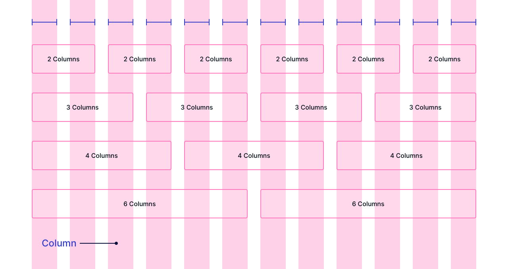
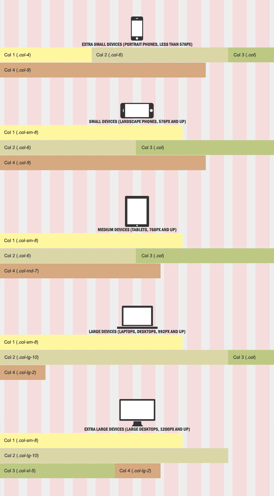

# Bootstrap

### Grid system (web design)

> 요소들의 디자인과 배치에 도움을 주는 시스템

- 기본 요소

  - Column : 실제 컨텐츠를 포함하는 부분
  - Gutter : 칼럼과 칼럼 사이의 공간 (사이 간격)
  - Container : Column들을 담고 있는 공간

- Bootstrap Grid system은 flexbox로 제작됨

- container, rows, column으로 컨텐츠를 배치하고 정렬

- 반드시 기억해야 할 2가지

  - 12개의 column / 6개의 grid breakpoints

  

  ___기본 구성___

  ```html
  <div class="container">
  	<div class="row">
  	<div class="col"></div>
  	<div class="col"></div>
  	<div class="col"></div>
  </div>
  ```

  

- Grid system breakpoints

  

  ___예시___ )  12칸 중 차지할 수 있는 칸의 갯수로 범위를 지정

  

  

  ___예시___ )  디스플레이별 표준 구성 방식

  

  ```html
  <!--12을 4칸씩 사용-->
  
  <div class="row">
  	<div class="box col-4">1</div>
  	<div class="box col-4">2</div>
  	<div class="box col-4">3</div>
  </div>
  ```

  

___예시___ ) 픽셀 별 구성

```html
@media (min-width: 576px) {
.container-sm, .container {
	max-width: 540px;
	}
}
@media (min-width: 768px) {
.container-md, .container-sm, .container {
	max-width: 720px;
	}
}
@media (min-width: 992px) {
.container-lg, .container-md, .container-sm, .container {
max-width: 960px;
}
}
@media (min-width: 1200px) {
.container-xl, .container-lg, .container-md, .container-sm, .container {
	max-width: 1140px;
	}
}
@media (min-width: 1400px) {
.container-xxl, .container-xl, .container-lg, .container-md, .container-sm, .container {
	max-width: 1320px;
	}
}
```
