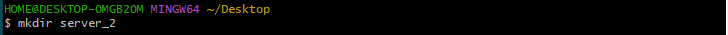
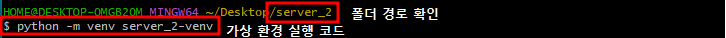
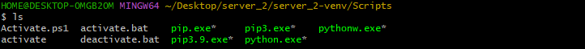
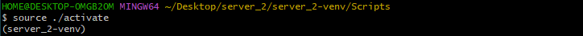
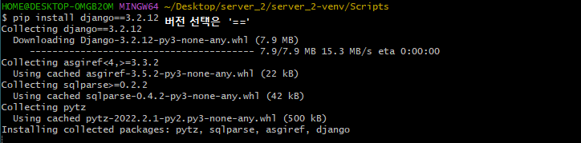
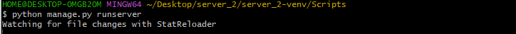
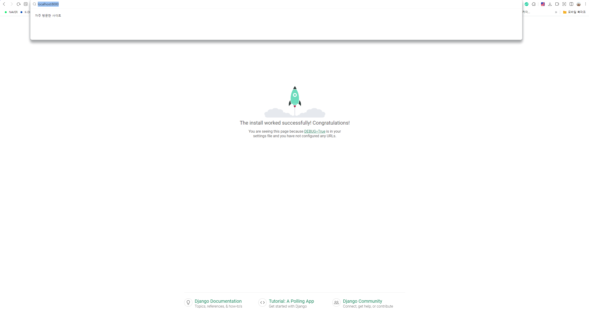

# 📢Django 개발 환경 설정 가이드

### 가상환경 생성/실행

- 진행할 프로젝트명으로 폴더 생성

  > mkdir = make directory

  

- 코드 입력하여 가상환경 실행

  > ✔_가상환경을 실행할 폴더에 위치해 있는지 확인_

- ls 실행하여 내부 정보 확인

- 가상환경 상위 폴더로 위치 이동

  > 상대경로를 항상 '__나__= .'로 설정
  >
  > 폴더 위치 마다 경로 코드 상이

### Django LTS 버전 설치

### Django 프로젝트 생성

> $ django-admin startproject [server_2_pjt 프로젝트명] [. 시작경로]

### Django 실행

- 장고 실행

- localhost (컴퓨터 주소):8000  실행 완료

