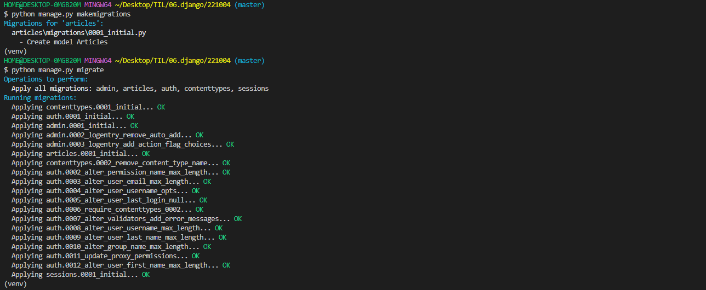

# django CRUD

## 프로젝트 전 준비사항

### 1. 가상환경 생성및 실행

```bash
가상 환경 생성
$ python -m venv nev

가상 환경 실행
$ source ./venv/Scripts/activate

--> 하단 (venv) 확인
```

### 2. django 다운

```bash
$ pip install django==3.2.13
$ pip freeze > requirements.txt
```

### 3. Django 프로젝트 생성
```bash
$ django-admin startproject pjt .

--> '.'의 의미는 해당 폴더 위치를 뜻한다.
```

---

## 2. articles app

### 1. app 생성
```bash
$ python manage.py startapp articles
```
### 2. app 등록
```python
pjt 폴더 settings.py 문서에
INSTALLED_APPS 안에 생성한 앱 이름을 넣어준다.

INSTALLED_APPS = [
    'articles',
]
## django는 끝에 ','를 붙여주는 것이 디폴트
```
### 3. urls.py 설정
```python
pjt(app 생성의 시작점)의 url에서 include를 통하여 articles의 urls.py에 있는 url을 참조 할 수 있는 구조로 구성한다.

## django.urls에 있는 include 기능을 불러오기
from django.urls import path, include


urlpatterns = [
    path('articles/', include('articles.urls')),
]
```

## 3. Model 정의 (DB 설계)

### 1. 클래스 정의
```python
class Articles(models.Model):
    # 제목 글자 수 제한
    title = models.CharField(max_length=20)
    # 내용
    content = models.TextField()
    # 생성 일자
    created_at = models.DateTimeField(auto_now_add=True)
    # 수정 일자
    updated_at = models.DateTimeField(auto_now=True)
```

🔑 `auto_now_add`와 `auto_now` 의 차이
- 생성 일자 : auto_now_add=True 사용
auto_now_add=True 는 django model 이 최초 저장(insert) 시에만 현재날짜(date.today()) 를 적용합니다.
- 수정 일자 : auto_now=True 사용
auto_now=True 는 django model 이 save 될 때마다 현재날짜(date.today()) 로 갱신됩니다.
주로 최종수정일자 field option 으로 주로 사용됩니다. 


### 2. 마이그레이션 파일 생성
```bash
# 생성
$ python manage.py makemigrations
```
### 3. DB 반영(migrate)

```bash
$ python manage.py migrate
```

> __완료 후__



---


## 4. CRUD 기능 구현

### 1. 게시글 생성
사용자에게 HTML Form 제공, 입력받은 데이터를 처리 (ModelForm 로직으로 변경)

1. HTML Form 제공
  http://127.0.0.1:8000/articles/new/

  ✔ urls.py

  ```python
  path("new/", views.new, name="new")
  #name을 붙여주어 APP_NAME = articles인 경우 --> 로 참조가 가능하게 해준다.
  ```

  ✔ views.py

  ```python
  def new(request):
      return render(request, "articles/new.html")
  ```

  ✔ template`( new.html )`

  ```html
  <!DOCTYPE html>
  <html lang="en">
  
  <head>
      <meta charset="UTF-8">
      <meta http-equiv="X-UA-Compatible" content="IE=edge">
      <meta name="viewport" content="width=device-width, initial-scale=1.0">
      <title>게시물 작성</title>
  </head>
  
  <body>
  </body>
  <form action="" method="POST">
  
      <label for="title"></label>
      <input type="title" id="title" name="title">
      <label for="content"></label>
      <input type="text" id="content" name="content">
      <input type="submit" value="완료">
  </form>
  
  </html>
  ```

  

2. 입력받은 데이터 처리
  http://127.0.0.1:8000/articles/create/

  > 데이터를 처리하는 목적으로 생성된 url로 
  >
  > 따로 template를 생성하지 않고 받은 데이터를 DB에 저장
  >
  > 그 후 받은 데이터를 메인(index)에 전송하는 기능을 수행한다.

  ✔ urls.py

  ```python
  path("create/", views.create, name="create")
  #name을 붙여주어 APP_NAME = articles인 경우 --> 로 참조가 가능하게 해준다.
  ```

  ✔ views.py

  ```python
  def create(request):
      # DB에 저장하는 로직
      title = request.POST.get("title")
      content = request.POST.get("content")
      # Article DB에 받은 title과 content 데이터를 받고 생성
      Article.objects.create(title=title, content=content)
      # 게시글 DB에 생성하고 index 페이지로 redirect
      return redirect("articles:index")
  ```

  🔑 `POST` 와 `GET`의 차이

  

### 2. 게시글 목록

✔ views.py

```python
def index(request):
    # 게시글 DB에서 가져온다.
    # order_by("-pk")는 최근 일수록 상단
    articles = Article.objects.order_by("-pk")
    # Template에 전달한다.
    context = {"articles": articles}
    return render(request, "articles/index.html", context)
```

✔ template`( index.html )`

```html
<!DOCTYPE html>
<html lang="en">

<head>
    <meta charset="UTF-8">
    <meta http-equiv="X-UA-Compatible" content="IE=edge">
    <meta name="viewport" content="width=device-width, initial-scale=1.0">
    <title>게시판</title>
</head>

<body>
    <h1>게시판</h1>
    <a href="">글 쓰기</a>
    <!-- DB에서 context(articles)를 받아서 for문 으로 작성된 게시물을 하나씩 출력-->
    
    <!-- article의 title 데이터-->
    {{ article.title }}
    <!--article의 created_at/ article.updated_at 데이터-->
    {{ article.created_at }} {{ article.updated_at }}
    
</body>

</html>
```


### 3. 상세보기

특정한 글을 본다.
http://127.0.0.1:8000/articles/int:pk/

✔ urls.py

```python
path("<int:pk>/", views.detail, name="detail")
```

✔ views.py

```python
def detail(request, pk):
	#DB에 pk(id=특정 값)을 받아서 보여준다.
    article = Article.objects.get(pk=pk)
    context = {"article": article}
    return render(request, "articles/detail.html",context)
```

✔ templat( detail.html )

```html
<!DOCTYPE html>
<html lang="en">

<head>
    <meta charset="UTF-8">
    <meta http-equiv="X-UA-Compatible" content="IE=edge">
    <meta name="viewport" content="width=device-width, initial-scale=1.0">
    <title>게시물</title>
</head>

<body>
    <h1>{{ article.pk }}번 게시글</h1>
    <h3>제목</h3>
    <p>{{ article.title }}</p>
    <h3>작성일</h3>
    <p>{{ article.created_at }} | {{ article.updated_at }}</p>
    <h3>내용</h3>
    <p>{{ article.content }} </p>
</body>

</html>
```

### 4. 삭제하기
특정한 글을 삭제한다.

http://127.0.0.1:8000/articles/int:pk/delete/
```html

```

### 5. 수정하기
특정한 글을 수정한다. => 사용자에게 수정할 수 양식을 제공하고(GET) 특정한 글을 수정한다.(POST)

http://127.0.0.1:8000/articles/int:pk/update/

✔ urls.py

```python
path("<int:pk>/update/", views.update, name="update")
```

✔ views.py

```python
def update(request, pk):
    #DB 특정 값을 받아온다.
    article = Article.objects.get(pk=pk)
    #article 폼을 받아온다.
    article_form = ArticleForm(instance=article)
    context = {"article_form": article_form}
    return render(request, "articles/update.html", context)
```

✔ templat( detail.html )

```html
<!DOCTYPE html>
<html lang="en">

<head>
    <meta charset="UTF-8">
    <meta http-equiv="X-UA-Compatible" content="IE=edge">
    <meta name="viewport" content="width=device-width, initial-scale=1.0">
    <title>게시물</title>
</head>

<body>
    <h1>{{ article.pk }}번 게시글</h1>
    <h3>제목</h3>
    <p>{{ article.title }}</p>
    <h3>작성일</h3>
    <p>{{ article.created_at }} | {{ article.updated_at }}</p>
    <h3>내용</h3>
    <p>{{ article.content }} </p>
</body>

</html>
```

### 
