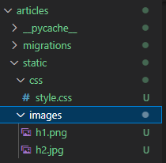
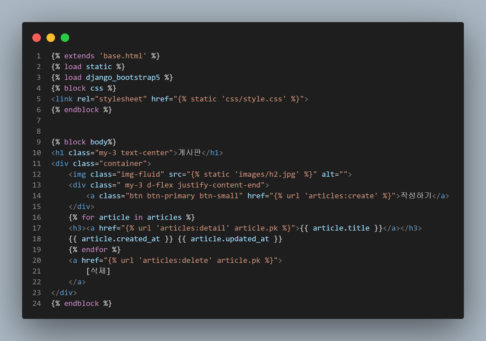
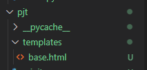
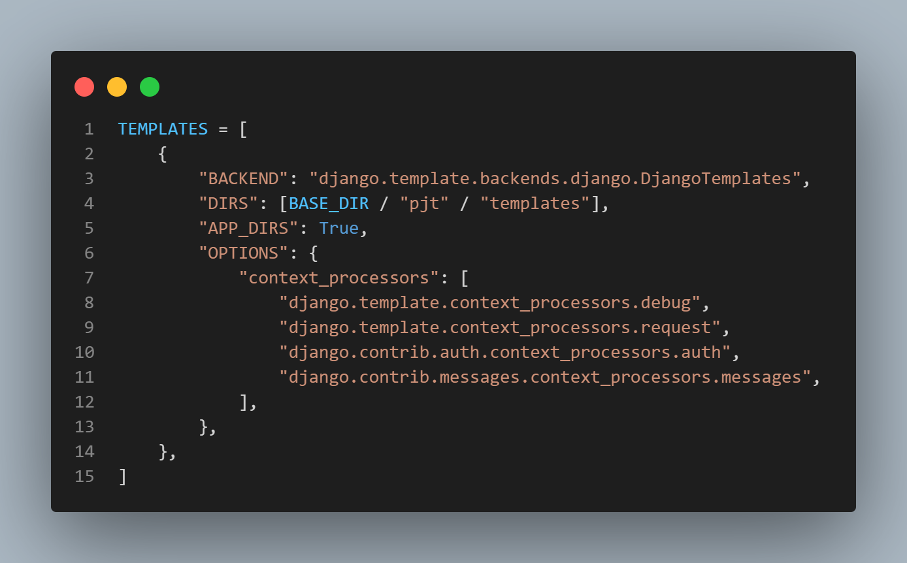
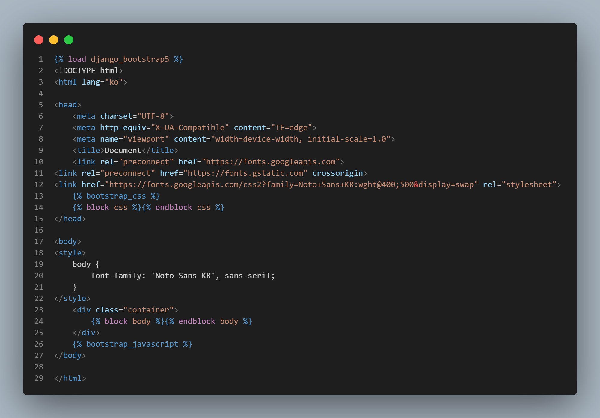

# django CRUD

## Django Staticfiles 활용한 정적 파일(css / image) 다루기

### 1. 생성한 앱 폴더에 static 파일생성




### 2. 적용할 template에 주석 달기

```hmtl


# static 이용하여 ulr 참조하기


```





## template base.html 적용하기

### 1.  template폴더 생성하여 html 생성

> 경로는 보통 project안의 폴더로 생성한다.




### 2. project의 templates에 참조할 주소 입력

> 경로 확인 필수




### 3. base.html

```
#block을 통해 다른 파일의 block 구간에 사용된다.
{block [name]}
.
.
.
{endblock}
```




### 4. html 파일에 적용

```html


# css

.
.
.


# body

.
.
.

```


