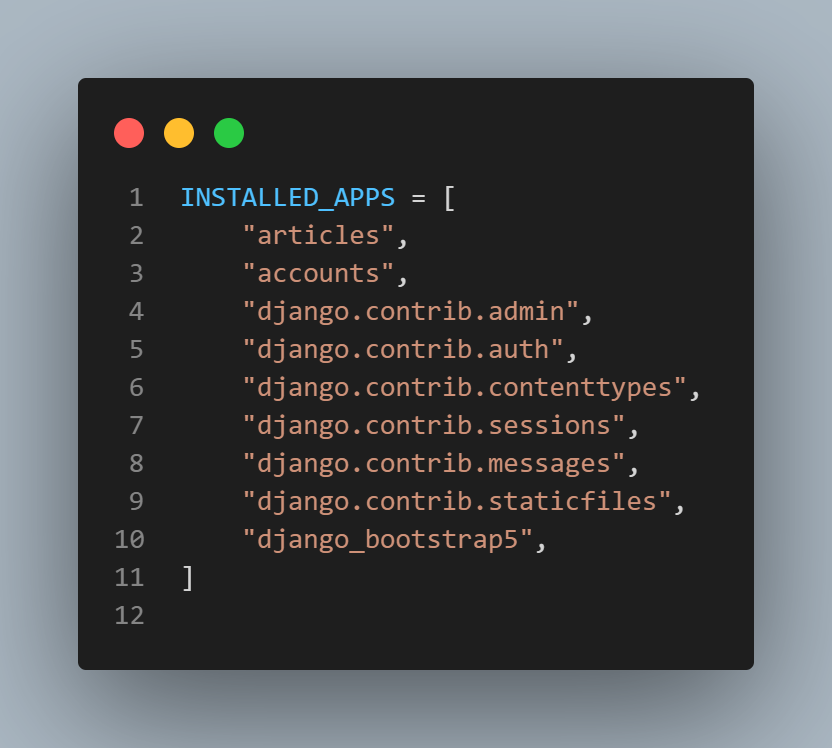
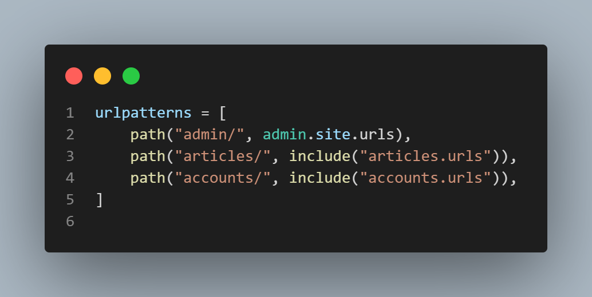
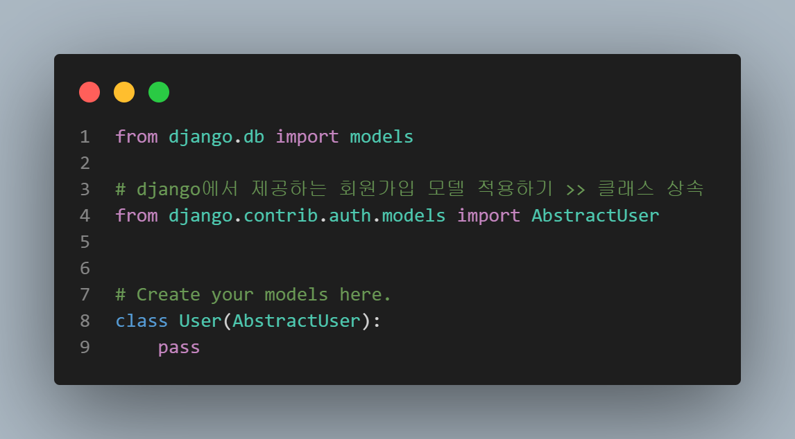
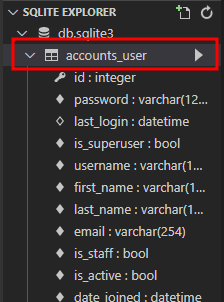
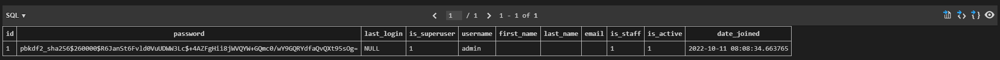
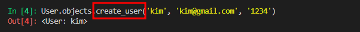
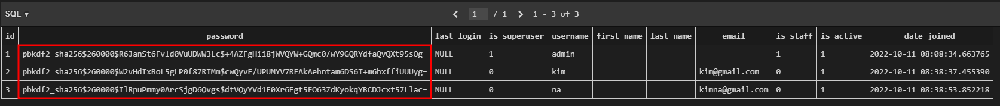
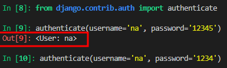

# django CRUD

## django auth

### authentication (인증)

- 신원 확인
- 사용자가 자신이 누구인지 확인하는 것

### authorization (권한, 허가)

- 권한 부여
- 인증된 사용자가 수행할 수 있는 작업을 결정


### 1. 사전 설정

#### 	1. startapp

```
python manage.py startapp accounts
```


#### 2. settings 앱 등록




#### 3. urls.py 등록




### 

### 2. DB

#### 1, model 등록

>  django에 있는  model을 가져와 쓴다 >> class 상속
>
> django user model




📌 model 등록 후 마이그레이션 -> 마이그레이트 필수

📌 이미 마이그레이션을 진행했다면?

- 데이터 초기화

  1. migration 파일삭제 (`__init__.py` 제외)

  2. db.sqlite3 삭제

  3. migrations 진행

     

#### 2. superuser 등록

```
$ python manage.py createsuperuser
```

```python
Username: admin
Email address: 
Password: 
Password (again): 

# password는 입력시 보이지 않음
```


##### >> 등록 후 account DB 확인하면 데이터가 admin으로 등록된 데이터가 확인된다.

- account DB




- 등록된 DB




### 3. user model 활용

#### user 생성

> django에서 자동으로 암호화가 실행되는 메서드 




``` 
User.objects.create_user('kim', 'kim@gmail.com', '1234')
```


_암호화 된 DB_




#### user 비밀번호 변경

```
user = User.objects.get(pk='키 값')
User.set_password('new password')
User.save()
```


#### user 인증 (비밀번호 확인)

```python
from django.contrib.auth import authenticate
user = authenticate(username='username', password='secret')

#password가 맞으면 값이 출력 된다.
```



