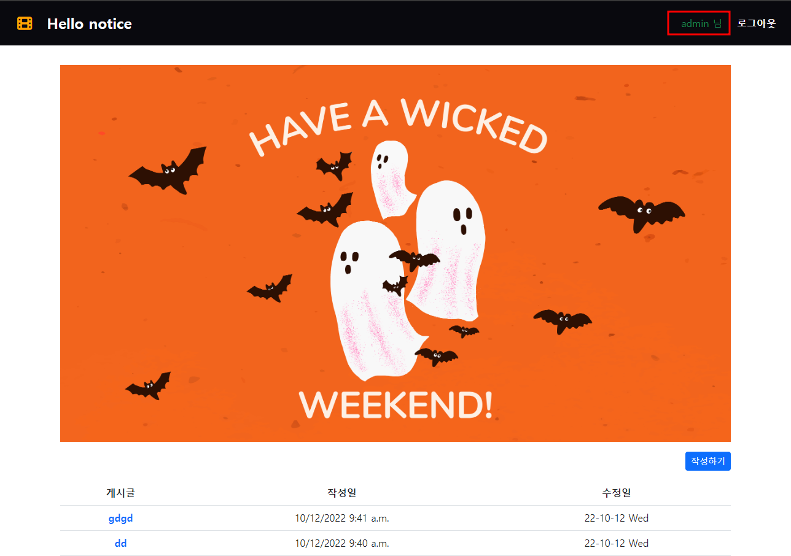

# django CRUD

## django auth 사용자 인증 (로그인&로그아웃)


### 로그인(login)

#### 1. urls.py

```python
from django.urls import path
from . import views

app_name = 'accounts'

urlpatterns = [
	path('login/', views.login, name='login'),
]
```

#### 2. views.py

```python
from .forms import CustomUserCreationForm
from django.contrib.auth import login as auth_login

def login(request):
    form = AuthenticationForm()
    context = {
        "form"def login(request):
    # AuthenticationForm 폼에 저장된 정보 검증
    form = AuthenticationForm()
    if request.method == 'POST':
        # AuthenticationForm은 ModelForm이 아님!
        form = AuthenticationForm(request, data=request.POST)
        if form.is_valid():
            # 세션에 저장
            # login 함수는 request, user 객체를 인자로 받음 
            # user 객체는 어디있어요? 바로 form에서 인증된 유저 정보를 받을 수 있음
            auth_login(request, form.get_user())
            return redirect('articles:index')
    else:
        form = AuthenticationForm(): form,
    }
    return render(request, "accounts/login.html", context)
```

📌 `CustomUserCreationForm` 란?

- 유저가 존재하는지 검증하는 django 내장 모델 form
- 사용자가 로그인 form에 작성한 정보가 유효한지 검증

📌 `auth_login` 

-  유저 정보를 세션에 생성 및 저장하는 역할을 하는 Django 내장 함수.

- `login_form.get_user()` 를 통해 `login_form`에 저장된 유저 정보를 갖고와 세션에 유저 정보를 생성함

📌 `get_user()`

- AuthenticationForm의 인스턴스 메서드

- 유효성 검사를 통과했을 경우 로그인 한 사용자 객체를 반환

  

#### 3. base.html

```html
<ul class="nav_menu">
  <li><a class="navbar_a" href="">로그인</a></li>
</ul>
```


#### 4. 현재 로그인 되어있는 유저 정보 출력하기



```html
<ul class="nav_menu">
    # user에 로그인한 사용자의 이름을 띄워준다.
      <li class="text-success">{{ user }} 님</li>
      <li><a class="navbar_a" href="">로그아웃</a></li>
</ul>
```

__✔ context없이 user 변수를 사용할 수 있는 이유는?__

- `작성된 컨텍스트 데이터`는 기본적으로 템플릿에서 `사용 가능한 변수`로 포함됨

- `settings.py`의 `context processors` 설정의 ‘django.contrib.auth.context_processors.auth’

  

### 로그아웃(logout)

> 요청 유저에 대한 세션 정보를 삭제함

#### 1. urls.py

```python
# accounts/urls.py
from django.urls import path
from . import views

app_name = 'accounts'

urlpatterns = [
	path('logout/', views.logout, name='logout'),
]
```


#### 2. views.py

```python
from django.contrib.auth import logout as auth_logout

def logout(request):
	auth_logout(request)
	return redirect('articles:index')
```


#### 3. base.html

 ```html
 <ul class="nav_menu">
   <li class="text-success">{{ user }} 님</li>
   <li><a class="navbar_a" href="">로그아웃</a></li>
 </ul>
 ```


⭐ __알게 된 점__

- django 내에 모듈(AuthenticationForm)로 유저가 존재하는지를 검증할 수 있다. 

- 서버와 클라이언트 간 지속적인 상태 유지를 위해 `쿠키와 세션`이 존재
  - 세션 관리에는 로그인, 아이디 자동완성, 공지 하루 안 보기, 장바구니 등이 있다.
- django에 작성되어 있는 변수 (user와 같은...) 는 context 없이도 사용 가능하다.
