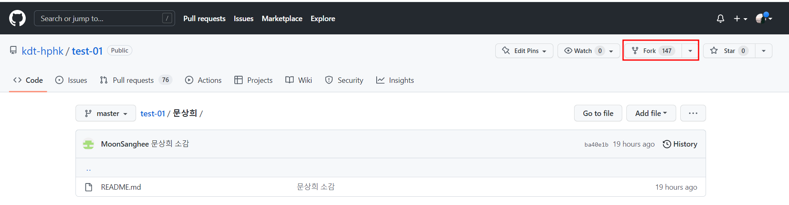
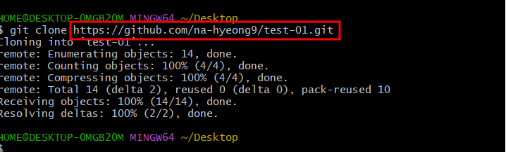
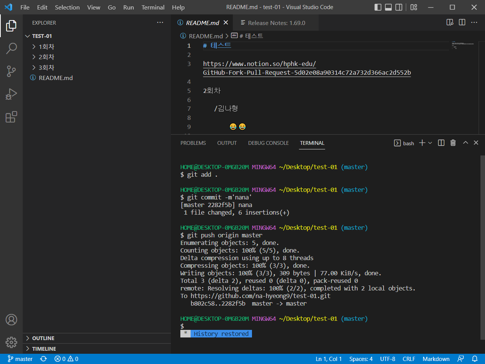
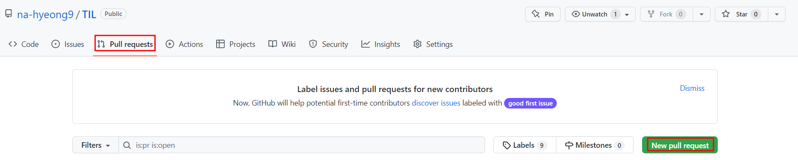
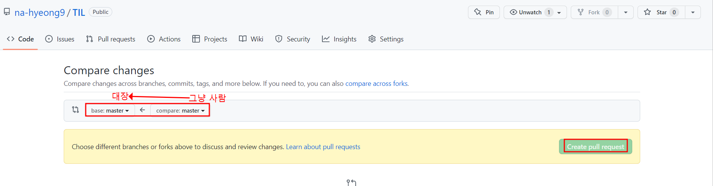

# Branch


- __작업/협업__하는 흐름 --> __branch__ 활용 (가지치기)

각자 개발을 진행하고 

_-> 각자 완료 branch 통합 

```asciiarmor
(master) $ git branch merge (exmanple)
```

이력(커밋)을 합치기 위해서는 일반적으로 _merge_ 명령어를 사용


---

### 1. 명령어

- git branch <branch name>

  > 브랜치 생성

- git checkout example

  > 해당 브랜치로 이동

- git branch -b <branch name>

  > 브랜치 생성및 이동
  
- git branch -d <branch name>

  > 브랜치 삭제

- git branch

  > 브랜치 목록

__(HEAD -> master)  뜻__

```master```의 가장 최근의 커밋 ```HEAD```


## 2. Forking Workflow

___Fork & pull model (저장소의 소유권이 없는 경우)___

- Fork

``` 
협업및 통합할 자료에서 Fork click
```




- git clone

```
나의 GitHub에 fork된 주소를 clone 실행하여 로컬 저장소로 복사
```




- 로컬 저장소에서 수정

```
code로 해당 폴더를 실행하여 수정 후 커밋
```




- Full request

```
보내는 방향 확인 후 click (수정한 원본 파일의 작업자 승인후 병합 완료)
```




