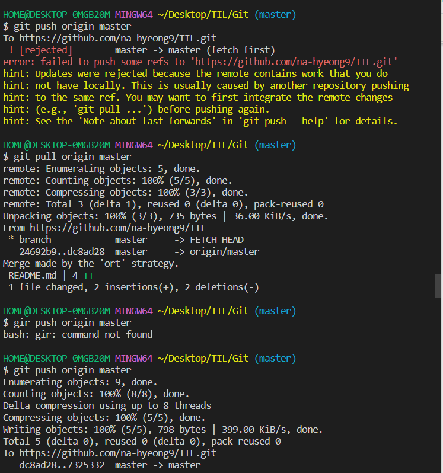

### 2022-07-07 에러사항



```
도대체 왜 자꾸 에러가 나는 걸까?
구글링을 해봤을 때 여러 방안이 있었다.


1. pull/push (git pull <원격 저장소> <브랜치>)
2. 강제적 push (git push -u origin <브랜치>)
3. 제어판 -> 원격 저장소 -> window 자격 증명 -> github (성명: 내 id)제거

```

_BUT_

 😂 전부 다 되지 않았다.


몇 번이나 하다 구글링으로 찾아낸 명령어로 완료..!

```css
1번 방법으로 진행 git pull 실행시 에러 확인
>>>>> git pull origin main --allow-unrelated-histories 입력
>>>>> push 실행
```

_이전에 오류를 생각 못하고 지워버렸더니 캡처를 못했다.. 다음엔 꼭_