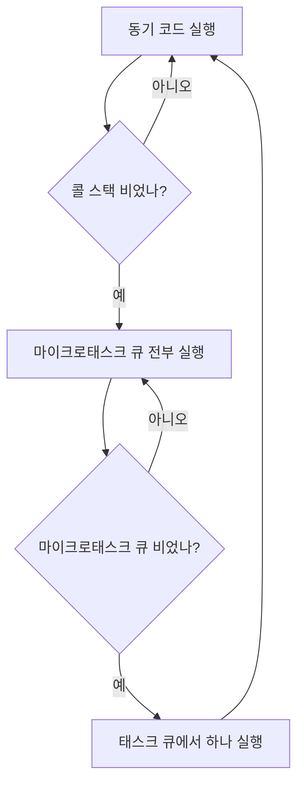

# 이벤트 루프 깊게 파기 — 콜 스택, 태스크 큐, 마이크로태스크 큐

> 2026.04.16

---

## 들어가기 전에

지난 편에서 이런 말을 했다.

> JS는 싱글 스레드인데, 브라우저가 도와줘서 비동기 처리가 가능하다.

근데 "브라우저가 도와준다"는 게 정확히 어떤 구조인지는 설명을 미뤄뒀다. 오늘이 바로 그 속을 들여다보는 날이다.

핵심 등장인물은 세 명이다. **콜 스택(Call Stack)**, **태스크 큐(Task Queue)**, **마이크로태스크 큐(Microtask Queue)**. 그리고 이 셋을 중재하는 **이벤트 루프(Event Loop)**.

---

## 콜 스택(Call Stack)

콜 스택은 JS가 지금 실행 중인 코드를 쌓아두는 공간이다. **스택(Stack)** 이라는 이름처럼 나중에 들어온 게 먼저 나가는 구조다(LIFO — Last In, First Out).

```js
function a() {
  b(); // b를 호출
}

function b() {
  console.log("b 실행");
}

a();
```

이게 실행되면 콜 스택은 이렇게 움직인다.

```
[a 호출]       → 스택: [ a ]
[a 안에서 b]   → 스택: [ a, b ]
[b 실행 완료]  → 스택: [ a ]
[a 실행 완료]  → 스택: [ ]
```

JS는 이 스택이 **완전히 비워질 때까지** 다른 코드를 실행하지 않는다. 이게 싱글 스레드의 본질이다.

---

## 그러면 비동기는 어디서 처리되나?

`setTimeout`처럼 시간이 걸리는 작업은 JS가 직접 처리하지 않는다. **브라우저의 Web API**한테 넘긴다.

```js
console.log("1");

setTimeout(function () {
  console.log("2");
}, 0); // 0ms라도 비동기!

console.log("3");
```

직관적으로는 `1 → 2 → 3`이 나올 것 같지만, 실제 출력은 `1 → 3 → 2`다. 왜 그럴까?

`setTimeout`은 콜 스택에서 바로 실행되는 게 아니라, 브라우저 Web API한테 넘겨지고 지정한 시간이 지나면 **태스크 큐**로 이동한다. 콜 스택이 완전히 비워진 다음에야 이벤트 루프가 태스크 큐에서 꺼내 실행시켜 주는 것이다.

---

## 태스크 큐(Task Queue)

태스크 큐는 Web API가 완료한 작업들이 대기하는 줄이다. **큐(Queue)** 답게 먼저 들어온 게 먼저 나간다(FIFO — First In, First Out).

`setTimeout`, `setInterval`, DOM 이벤트 콜백 등이 여기 들어온다.

이벤트 루프는 콜 스택이 비어있을 때만 태스크 큐에서 하나씩 꺼내 콜 스택으로 올린다. 한 번에 하나씩만.

---

## 마이크로태스크 큐(Microtask Queue)

여기서 중요한 반전이 있다. 큐가 사실 하나가 아니다.

**마이크로태스크 큐**는 태스크 큐와 별개로 존재하는, 더 높은 우선순위를 가진 큐다. `Promise`의 `.then()`, `.catch()`, `async/await`, `queueMicrotask()` 등이 여기 들어온다.

우선순위가 어떻게 다른지 직접 보면 바로 이해된다.

```js
console.log("1");

setTimeout(function () {
  console.log("2 - setTimeout"); // 태스크 큐
}, 0);

Promise.resolve().then(function () {
  console.log("3 - Promise"); // 마이크로태스크 큐
});

console.log("4");

// 출력:
// 1
// 4
// 3 - Promise  ← setTimeout보다 먼저!
// 2 - setTimeout
```

`setTimeout`이 0ms임에도 Promise보다 늦게 실행됐다. 이유는 이벤트 루프의 처리 순서 때문이다.

---

## 이벤트 루프의 실제 동작 순서

이벤트 루프는 매 사이클마다 이렇게 동작한다.



핵심은 **마이크로태스크 큐는 전부 비울 때까지**, 태스크 큐는 **하나씩만** 처리한다는 차이다.

위 예시를 다시 추적해보면 이렇다.

```
[콜 스택 실행]
  → console.log("1")            출력: 1
  → setTimeout → Web API로 넘김
  → Promise.then → 마이크로태스크 큐에 등록
  → console.log("4")            출력: 4
  → 콜 스택 비워짐

[마이크로태스크 큐 비우기]
  → console.log("3 - Promise")   출력: 3

[태스크 큐에서 하나 꺼내기]
  → console.log("2 - setTimeout") 출력: 2
```

---

## 마이크로태스크가 무한히 쌓이면?

이론적으로 마이크로태스크 큐를 계속 채우면 태스크 큐는 영원히 실행되지 못한다.

```js
// 이러면 태스크 큐가 절대 실행 안 됨 (실제로 하면 안 됨!)
function infiniteMicrotask() {
  Promise.resolve().then(infiniteMicrotask);
}
infiniteMicrotask();

setTimeout(() => console.log("나는 영원히 못 나와"), 0);
```

실제 개발에서 이런 상황은 거의 없지만, 우선순위 개념을 이해하는 데 좋은 극단적 예시다.

---

## 오늘 얻은 것

"비동기는 기다리지 않는다"에서 한 단계 더 들어가서, 실제로 어떤 순서로 실행되는지가 보이기 시작했다. 특히 마이크로태스크와 태스크 큐의 우선순위 차이는 처음엔 헷갈렸는데, 이벤트 루프가 매 사이클마다 마이크로태스크를 **전부** 비우고 태스크를 **하나씩** 꺼낸다는 규칙으로 외우니까 명확해졌다.

이걸 이해하면 `async/await`이 내부적으로 어떻게 동작하는지, 왜 `await` 뒤에 오는 코드가 마이크로태스크로 처리되는지도 자연스럽게 납득이 간다.
