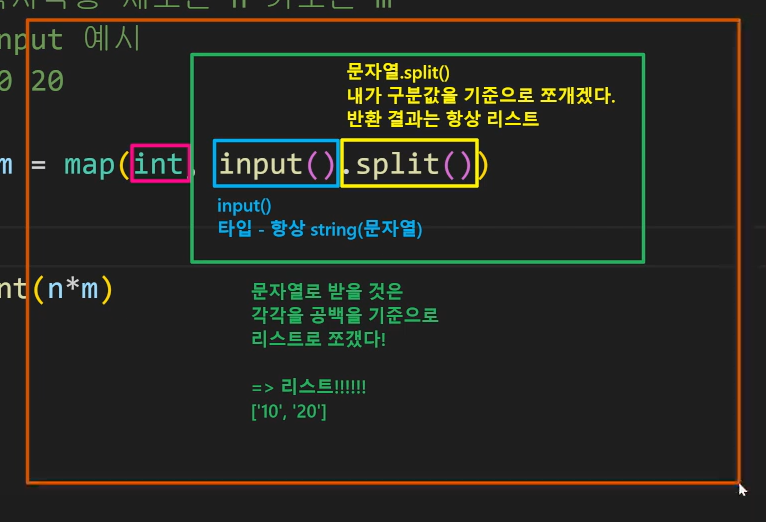

# Python 함수 (function)

특정한 기능을 하는 코드의 조각(묶음)

참고 사이트 : [파이썬자습서](https://docs.python.org/ko/3/tutorial/index.html)


## 함수기초

- 함수의 정의

  > 특정한 기능을 하는 코드의 조각(묶음)

- 사용자 함수

  > 구현되어 있는 함수가 없는 경우, 사용자가 직접 정의 가능

  

### 함수 기본 구조

#### 1. 선언과 호출

```python
# def 키워드 활용
# 들여쓰기를 통해 Function

# 함수는 함수명()'소괄호'로 호출

def foo():
    print(True)
    
# 1. def
# 2. 함수 이름 : add
# 3. input : a, b
def add (a, b):
def minus (a, b):
    #4 . return : 값을 반환
    return a + b
print(add(5, 10))
print(minus(10, 5))

# 호출
15
5

# 내장함수 호출
print(sum([1, 2, 3]))

# 예시
num1 = 0
num2 = 1
def func1(a, b):
    return a + b
def func1(a, b):
    return a - b
def fucn3(a, b):
    return func1(a, 5) + fucn2(5, b)

result = func3(num1,num2)
print(result)
```


#### 2. 함수의 결과값(Output)

> return 값 만나면 함수는 종료됨
>
> 함수값과 return이 1:1

```python
# print 함수는 출력을 해주고 return 값은 없습니다. (None) 
# return은 값을 반환

a =  print('hi')

print(a, type(a)) # None <class 'NoneType'>
```


#### 3. 함수의 입력 (Input)

- Parameter 

  함수를 실행할 떄, 함수 내부에서 사용되는 식별자

- Argument

  함수를 호출할 때 , 넣어주는 값 (Prameter를 통해 전달되는 값)

  - positional (기본)

  - keyword

    ```python
    def add(x,  y):
        return x + y
    
    # 가능
    def add (x=2, y=3)
    def add (2, y=3)
    
    # 불가능
    def add (x=2, 3)
    
    # y=0 기본값 지정/y을 설정하지 않아도 기본값으로 출력해줌.
    # 2
    def add (2, y=0)
    add(2)
    ```

    

  - Default Argument Value

    ```python
    # 기본값이 sep는 ' '으로 정의가 되어있음
    print (a, b) # a b
    
    print (1, 2, 3, 4, 5, 6, 7, 8) 
    
    # 정해지지 않은 갯수의 인자
    def my_add(*numbers):
        #내부적으로 numbers가 tuple
        return numbers
    
    
    result = my_add(1, 2, 3)
    print(result, type(result)) #(1, 2, 3) <class 'tuple'>
    
    ```


- 함수의 범위 (Scope)

  > 함수는 코드 내부에 local scope

  - 객제 생명주기

    bulit -in scope : print , sum, len

    global scope : a = 3

    local scope

  - 이름 검색 규칙

    내장 함수 이름으로 변수명을 짓게 되면 오류발생

    B -> G -> E -> L 순으로

### 4.함수 응용

- map

  모든 반복 가능한 것에 내가 적용하고 싶은 함수를 정함

  ```python
  # 숫자로 바꿔서 쓰고 싶다
  # 리스트를 숫자로 형 변환은 불가능
  # 다만 숫자 형태의 문자를 변환할 수는 있다.
  
  numbers = ['1', '2', '3']
  
  a = int(numbers[0])
  b = int(numbers[1])
  c = int(numbers[2])
  
  # 반복문
  new_numbers = []
  for numbers in numbers:
      new_numbers.append int((number))
  print(new_numbers)
  
  n, m = map(int, input(). split())
  print(n*m)
  
  ```

  




## 예제 풀이

```python
#함수값에 이름을 붙인다.
def r(a, b):
    a = a * b
    b = (a + b)* 2
    return(a, b)
print(20, 30)
```

