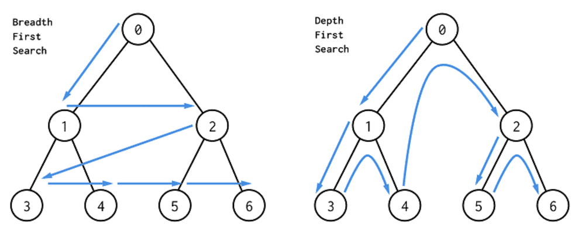
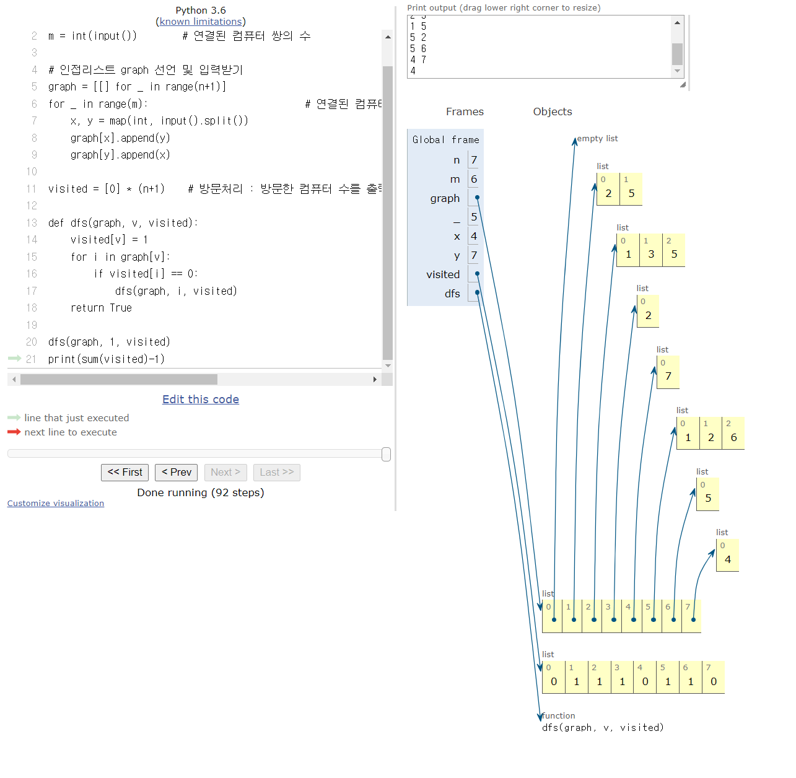

# 그래프

1. 그래프에 대한 이해
>정점(Vertex)과 이를 연결하는 간선(Edge)들의 집합으로 이루어진 비선형 자료구조
소셜 네트워크와 지하철 노선도 같이, 현실에 있는 개체 간의 관계를 나타내기 위해 사용한다.

- 그래프 관련 용어

  - 정점(Vertex) : 간선으로 연결되는 객체이며, 노드라고도 한다.
  - 간선(Edge) : 정점 간의 관계(연결)를 표현하는 선을 의미한다.
  - 경로(Path) : 시작 정점부터 도착 정점까지 거치는 정점을 나열한 것을 의미한다.
  - 인접(Adjacency) : 두 개의 정점이 하나의 간선으로 직접 연결된 상태


2. 그래프의 종류

    1. 무방향 그래프 (Undirect grahp)
        - 간선의 방향이 없는 가장 일반적인 그래프
        
        - 간선을 통해 양방향의 정점 이동 가능
        
        - 차수(Degree) : 하나의 정점에 연결된 간선의 개수
        
        - 모든 정점의 차수의 합 = 간선 수 x 2
        
          
        
    2. 유방향 그래프
        - 간선의 방향이 있는 그래프
        - 간선의 방향이 가리키는 정점으로 이동 가능
        - 차수(Degree) : 집입 차수와 진출 차수로 나누어짐
            진입 차수 (In degree) : 외부 정점에서 한 정점으로 들어오는 간선의 수
            진입 차수 (Out degree) : 한 정점에서 외부 정점으로 들어오는 간선의 수

    

 3. 그래프의 표현

    ```python
    grahp = {
       0 : [1, 2],
       1 : [0, 3, 4],
       2 : [0, 4, 5],
       3 : [1],
       4 : [1, 2, 6]
       5 : [2],
       6 : [4]
     }
    # grahp[0][0] => 1
    
    # 인덱스
    grahp = {
       [1, 2],
       [0, 3, 4],
       [0, 4, 5],
       [1],
       [1, 2, 6]
       [2],
       [4]
     }
    # grahp[0][0] => 1
    ```

    - 인접 행렬

      > 두 정점을 연결하는 간선이 없으면 0, 있으면 1을 가지는 행렬로 표현하는 방식

      ```python
      # 인접 행렬 만들기
      n = 7 # 정점 개수
      m = 7 # 간선 개수
      
      graph = [[0] * n for _ in range(n)]
      
      for _ in range(m):
      v1, v2 = map(int, input().split())
      graph[v1][v2] = 1
      graph[v2][v1] = 1
      
      # 인접 행렬 결과
      graph = [
      [0, 1, 1, 0, 0, 0, 0],
      [1, 0, 0, 1, 1, 0, 0],
      [1, 0, 0, 0, 1, 1, 0],
      [0, 1, 0, 0, 0, 0, 0],
      [0, 1, 1, 0, 0, 0, 1],
      [0, 0, 1, 0, 0, 0, 0],
      [0, 0, 0, 0, 1, 0, 0]
      ]
      ```

      

    - 인접 그래프

      > 리스트를 통해 각 정점에 대한 인접 정점들을 순차적으로 표현하는 방식

      ```python
      # 인접 리스트 만들기
      n = 7 # 정점 개수
      m = 7 # 간선 개수
      
      graph = [[] for _ in range(n)]
      
      for _ in range(m):
      v1, v2 = map(int, input().split())
      graph[v1].append(v2)
      graph[v2].append(v1)
      
      # 인접 리스트 결과
      graph = [
      [1, 2],
      [0, 3, 4],
      [0, 4, 5],
      [1],
      [1, 2, 6],
      [2],
      [4]
      ]
      ```

      ```인접 행렬```은 직관적이고 만들기 편하지만, 불필요하게 공간이 낭비된다.

      ```인접 리스트```는 연결된 정점만 저장하여 효율적이므로 자주 사용된다.

      ----

      

### 📌그래프 탐색 알고리즘이란?

시작 정점에서 간선을 타고 이동할 수 있는 모든 정점을 찾는 알고리즘


1. 그래프 탐색 알고리즘

   ```너비우선탐색(BFS)``` vs ```깊이우선탐색(DFS) ``` 




2.  깊이우선탐색

   - 모든 정점을 방문할 때 유리하다. 따라서 경우의 수, 순열과 조합 문제에서 많이 사용

   - 너비우선탐색에 비해 코드 구현이 간단하다.

     _but,_ 모든 정점을 방문할 필요가 없거나 최단거리를 구하는 경우에는 너비우선탐색이 유리하다.

   

   

   ### ✔ 바이러스 예제 😱

   ​	```python Tutor```로 실행한 결과



코드 참조: [https://devmath.tistory.com/21](https://devmath.tistory.com/21)

